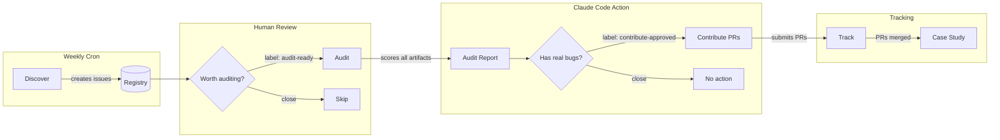

# nlpm-auditor

Automated pipeline for discovering, auditing, and contributing to Claude Code plugin and skill repos across GitHub.

Uses [NLPM](https://github.com/xiaolai/nlpm-for-claude) scoring (50 rules, 100-point scale) and [claude-code-action](https://github.com/anthropics/claude-code-action) for automated analysis.

## How It Works



## Pipeline

| Workflow | Trigger | What it does |
|----------|---------|-------------|
| `discover.yml` | Weekly cron / manual | Searches GitHub for Claude Code repos with 500+ stars and 5+ NL artifacts |
| `audit.yml` | Issue labeled `audit-ready` | Clones repo, runs NLPM scoring via claude-code-action, writes audit report |
| `contribute.yml` | Issue labeled `contribute-approved` | Forks repo, creates PRs for verified bugs only (max 5) |
| `track.yml` | Weekly cron | Checks PR status, marks case study candidates when PRs merge |

## Issue Labels

| Label | Meaning |
|-------|---------|
| `audit-candidate` | Discovered by crawler, awaiting human review |
| `audit-ready` | Approved for audit — triggers `audit.yml` |
| `audit-complete` | Audit report generated |
| `contribute-approved` | Human approved PR submission — triggers `contribute.yml` |
| `prs-submitted` | PRs have been submitted to the target repo |
| `case-study-ready` | PRs merged, ready to write a case study |

## Rules of Engagement

1. **Only submit PRs for verified bugs** — missing fields that break registration, tools called but not in allowed-tools, broken references
2. **Never PR convention preferences** — YAML format, missing examples, vague language, model tier
3. **One tracking issue first** — explain methodology before PRs
4. **Max 5 PRs per repo** — focused, minimal diffs
5. **Max 2 repos per week** — don't carpet-bomb
6. **Accept "no" gracefully** — close PRs, thank, learn

## Setup

1. Create the repo on GitHub
2. Add secrets:
   - `ANTHROPIC_API_KEY` — for claude-code-action
   - `PAT_TOKEN` — GitHub PAT with `public_repo` scope (for forking and PRing to other repos)
3. Create the issue labels listed above
4. Run `discover.yml` manually to seed the registry

## Directory Structure

```
registry/repos.json    — Tracking database (all discovered repos + status)
audits/                — Generated audit reports (one per repo)
case-studies/          — Polished case studies (promoted from audits)
```

## Prerequisites

- GitHub Actions enabled
- `ANTHROPIC_API_KEY` secret
- `PAT_TOKEN` secret with `public_repo` scope
